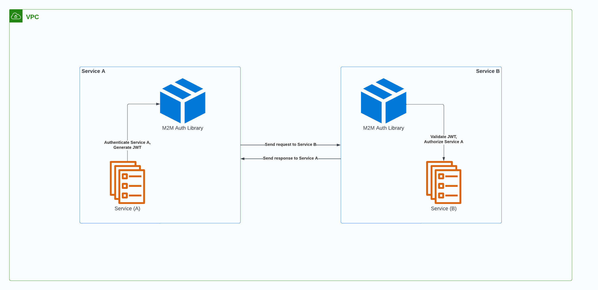

# M2M python library

## Overview

Machine to machine (M2M) authentication allows services to communicate with each other in a secure manner. The `m2m-auth` library achieves this by validating client requests across our internal services and API's.



> [!IMPORTANT]
> If you need M2M authentication for a Python2 service, use [this]() library instead.

## Installation

To install the latest version of `m2m-auth`, include the following code snippet at the end of your project’s `requirements.txt` file. For past versions, see the [changelog]().

```
--extra-index-url https://nexus.com/repo/m2m-auth/packages
https://nexus.com/repo/m2m-auth/packages/m2m-auth/1.0.8.tar.gz
```

Then run:

```
pip install -r requirements.txt
```

## Using the module

Begin by importing the m2m requests module into your project and instantiating the requests client.

```python
from m2m_client.requests import M2MRequests

requests_client = M2MRequests()
```

### Outgoing requests

The request types available through `m2m-auth` are the RESTful HTTP types.

The M2M library uses your client id, client secret, and audience to authenticate your application and obtain a JWT (JSON Web Token). This token is then appended to your request headers, and later decoded by the service receiving said request, in order to authorize the transaction.

> [!NOTE]
> You **must** supply your `client_id`, `client_secret`, and `audience` as either arguments or environment variables, in order to use M2M requests.

The client id and secret are the credentials you obtained when [creating an Auth0 Client]() for your service. The audience, however, should be the one expected by the receiving application.

#### Requests:

`get(url, params=None, client_id=None, client_secret=None, audience=None, **kwargs)`

`post(url, data=None, json=None, client_id=None, client_secret=None, audience=None, **kwargs)`

`put(url, data=None, client_id=None, client_secret=None, audience=None, **kwargs)`

`patch(url, data=None, client_id=None, client_secret=None, audience=None, **kwargs)`

`delete(url, client_id=None, client_secret=None, audience=None, **kwargs)`

> [!WARNING]
> All `client_secret` values must be stored securely (NOT checked into version control). We encourage storing them in a solution such as AWS Secrets Manager, via Terraform, or as Gitlab CI/CD variables.


| Parameters | Description | Example
| --- | --- | --- |
| `url` | The url of the service you want to communicate with. | url1.rev.com |
| `params` | Additional data you want to send in the URL's query string. | `{'key':'value'}` |
| `data` | Additional data you want to send (as a dictionary or list of tuples). | `{'key':'value', 'key2':'value2'}` |
| `json` | Use this parameter when specifically sending json data. Requests will serialize your data and add the correct `Content-Type` header automatically (`application/json`). The `json` parameter is ignored if `data` is passed. | `{'key':'value'}` |
| `client_id` | Your application's client id. | abc123 |
| `client_secret` | Your application's client secret. | ****** |
| `audience` | The unique identifier for the target API you want to access. | newaudience.rev.com |

#### Example request

Here's a simple GET request:

```python
from m2m_client.requests import M2Mrequests

try:
	requests_client = M2Mrequests()
	response = requests_client.get(url=url, client_id=client_id, client_secret=client_secret, audience=audience)
except HTTPError as e:
	LOGGER.debug(f'Status code: {e.response.status_code}')
```

For a list of library errors and exceptions, see the **errors and exceptions** section below. 

The content of the response object will vary depending on the specific service you are requesting from. As such, each service may present additional error responses.


#### Rate limiting

In the event that your service reaches Auth0's rate limit, the M2M library will handle the error by using retries and exponential backoff. If all fails, the library will throw an `Auth0RateLimitReachedException`, with status code 429.


### Incoming requests

Use the `authenticate` decorator on a given endpoint to authenticate **incoming** M2M requests.

The decorator takes in two parameters:
* `audience`: the unique identifier for the API being accessed.
* `auth0_domain`: the Auth0 tenant that hosts your Auth0 client.

Here's a simple implementation:

```python
from m2m_client.flask.decorators import authenticate

@app.route(‘/api/hello/’)
@authenticate(audience=‘testapi’, auth0_domain=‘rev-test.us.auth0.com’)
def hello():
	return ‘Hello, World!’
```

The `authenticate` decorator will attempt to find a JWT token in the request headers. If present, the decorator will decode the token and validate the incoming client credentials against the given audience (within the given domain).

For a list of available Auth0 domains, see [here]().

If you do not have an audience for your endpoint, learn how to create one [here]().


### Errors and exceptions

* `NullClientIdError` is raised if the client_id is not supplied.
* `NullClientSecretError` is raised if the client_secret is not supplied.
* `NullAudienceError` is raised if the audience is not supplied.

* `Auth0RateLimitReachedException` is raised if the Auth0 rate limit is reached.
* `AuthenticationError` is raised for any other authentication error.

For additional information on error handling, see [here]().


## Troubleshooting

If you run into any issues or have any questions, feel free to reach out in the `#eng-m2m-auth` slack channel.
